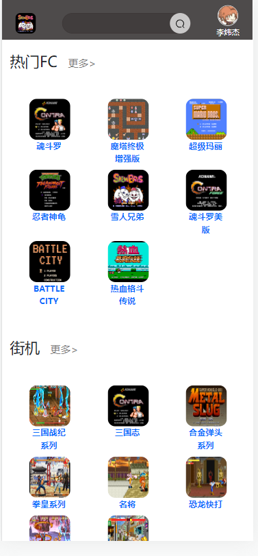
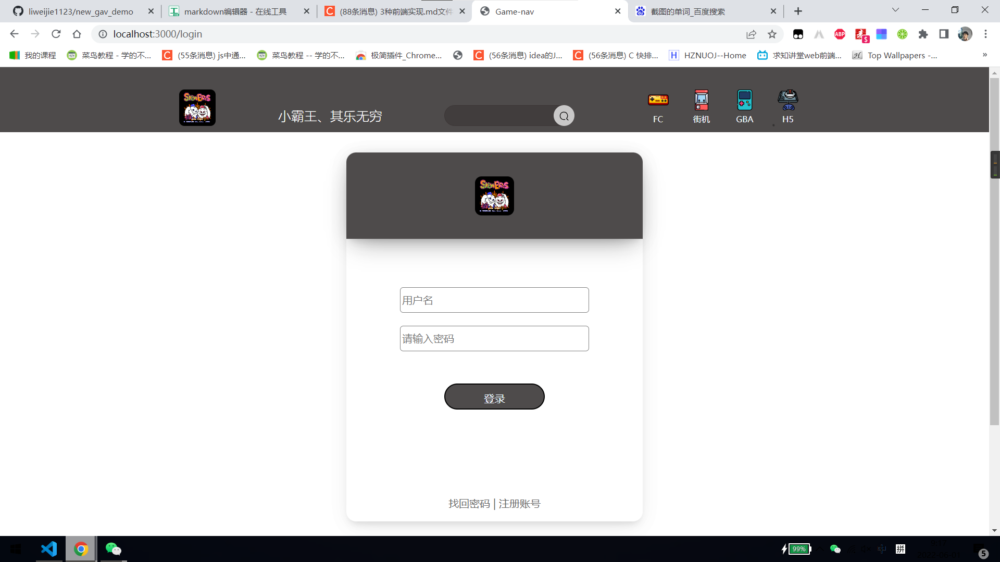
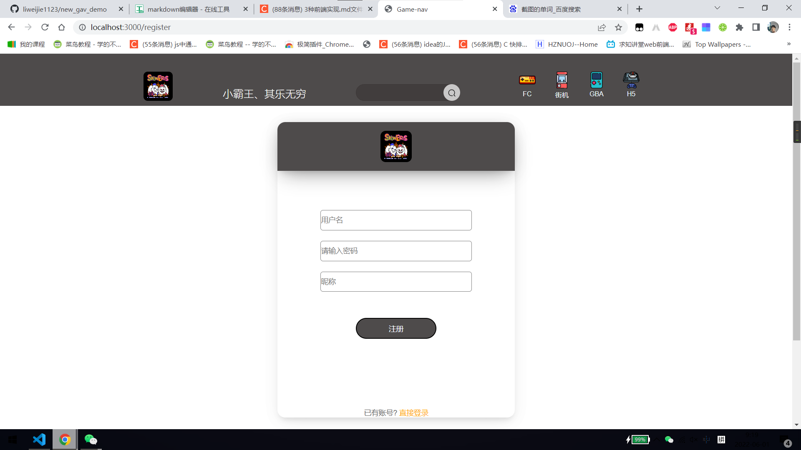
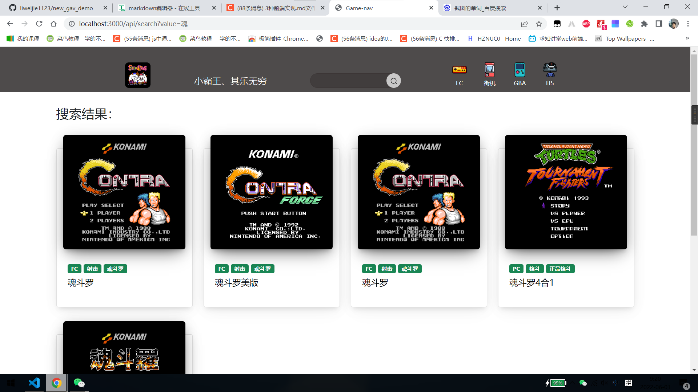
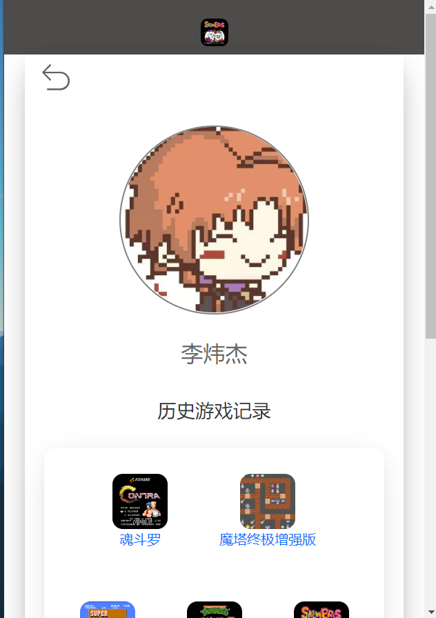
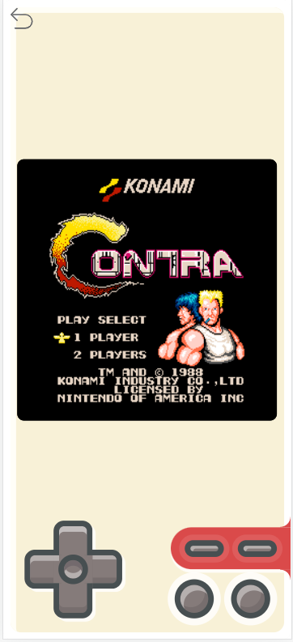
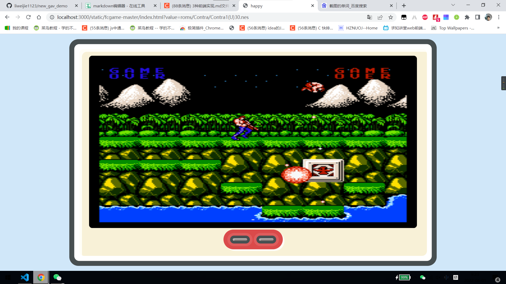

**8K8K游戏黄页**

**项目成员**

| 项目成员             | 工作 |
| -------------------- | ---- |
| 李炜杰 2020210308022 | 组长 |
| 周熙皓 2020212205010 |      |

**项目描述**

实现一个在线的游戏网站，提供各种 FC 小游戏。

**采用的技术**


采用nodejs+express+art-template
前端采用art-template对页面进行渲染
后端采用express框架完成对前端前端页面请求的处理简单的实现了用户的登录注册功能和游戏的模糊搜索。


**界面设计**

pc端

移动端




**数据结构**

使用的是json存储

用户的json格式为

"username":"123","password":"123","nickname":"李炜杰","headimg":"static/img/headimg/1.jpeg"

游戏数据的json格式为

```
{
            "name": "魂斗罗",
            "url": "/static/img/1.png",
            "href": "/static/fcgame-master/index.html?value=roms/Contra/Contra1(U)30.nes",
            "type": [
                {
                    "type": "FC"
                },
                {
                    "type": "射击"
                },
                {
                    "type": "魂斗罗"
                }
            ]
        },
```
功能模块


登录：





注册:





模糊搜索：





用户中心：





游戏界面：








